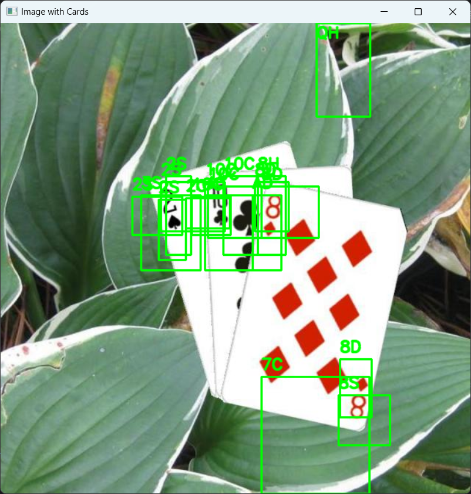
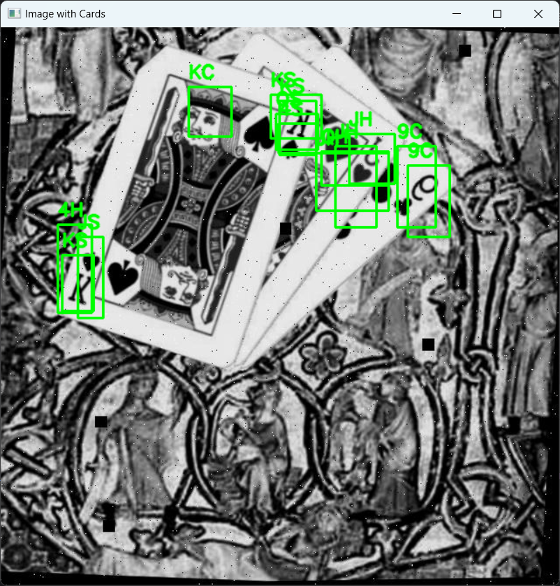
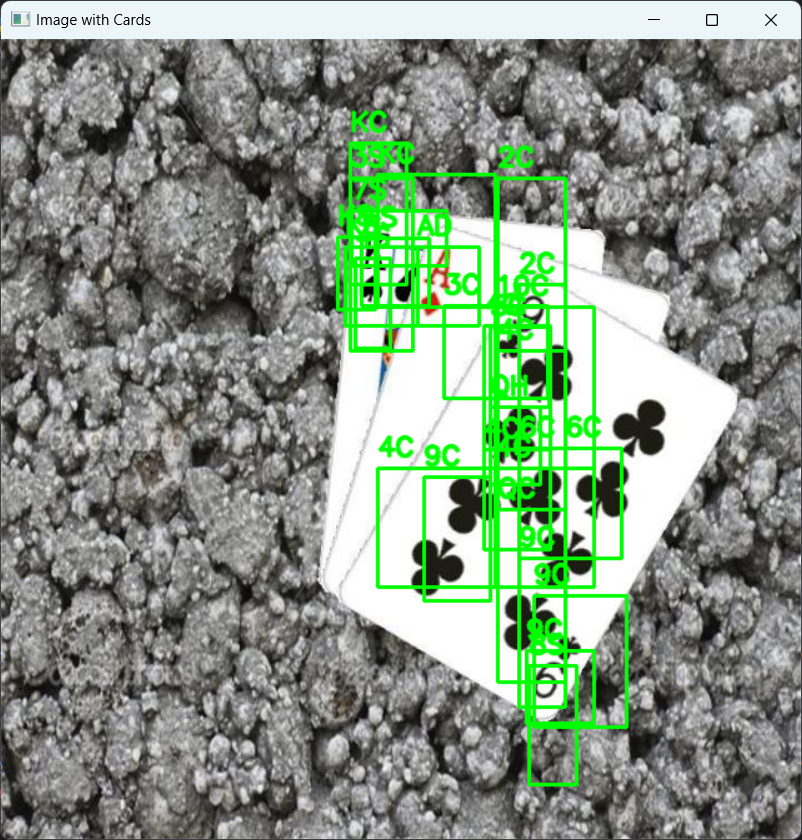

# Playing Card Recognition with Constructive Neural Networks  

## Problem Description  
The goal of this project was to develop a model capable of recognizing playing cards in images without using any pre-existing models e.g. YOLO. A key challenge was accurately identifying partially obscured cards or cards viewed from varying angles, reflecting how cards are typically held during social games. 

## Dataset Preparation  
The dataset consists of **22,000 images**, each annotated with:  
- Class labels  
- Normalized bounding box coordinates in the format `(label, x_center, y_center, width, height)`  
Each image contains **3 to 5 cards**.  

## Model Training  
### Binary Model (Card Presence Detection)  
A binary classifier detects whether a card exists in an image region.  
- **Input**: `128x128x3` RGB patches  
- **Preprocessing**: Undersampling to balance classes, normalization  
- **Architecture**: Custom CNN with convolutional layers and fully connected layers  
- **Accuracy**: Achieved satisfactory performance in distinguishing card/non-card regions  

### Classification Model (Card Label Prediction)  
A CNN classifies detected cards into 52 possible classes (suits and ranks).  
- **Architecture**:  
  - 5 convolutional blocks (32 → 512 channels) with `2x2` pooling  
  - Fully connected layers (512 → 256 → 52 neurons)  
  - Dropout for regularization  
- **Output**: Probability distribution over card classes  

## Constructive Localization Approach  
A multi-stage process to detect cards without traditional object detection frameworks:  
1. **Image Splitting**: Divide input image into candidate regions  
2. **Multi-Level Analysis**:  
   - Use binary model to identify candidate regions  
   - Recursively split positive regions for finer localization  
3. **Bounding Box Generation**:  
   - Merge overlapping detections  
   - Scale coordinates to original image dimensions  
4. **Result Aggregation**: Sort detections by confidence  

## Performance  
- Correctly detects all visible cards in **74%** of test cases  
- Struggles with duplicate detections and similar-looking classes (e.g., "KS" vs "KC")  

### Example Detections  
  
`Predicted: ['8D', '10C', '2S']`  

  
`Predicted: ['KS', 'JH', '9C']`  

  
`Predicted: ['9C', 'KS', '4C', 'KC', 'AD']`  

### HOW TO USE
You require python 3.ll or newer and the libraries listed in the requirements.txt file. 

Run object_detection.py in classification folder. Paste your image's path into terminal. The program will return a list of cards it believes are in the picture and display found etiquettes on the picture. 
